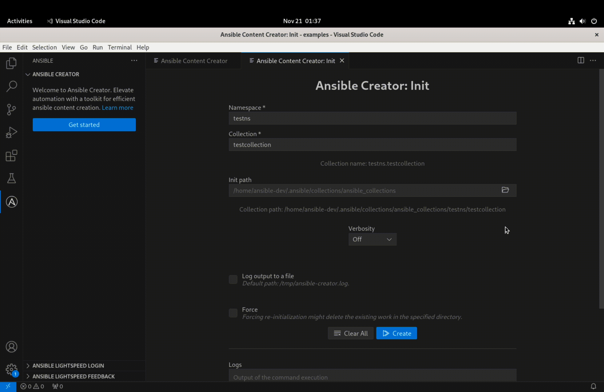
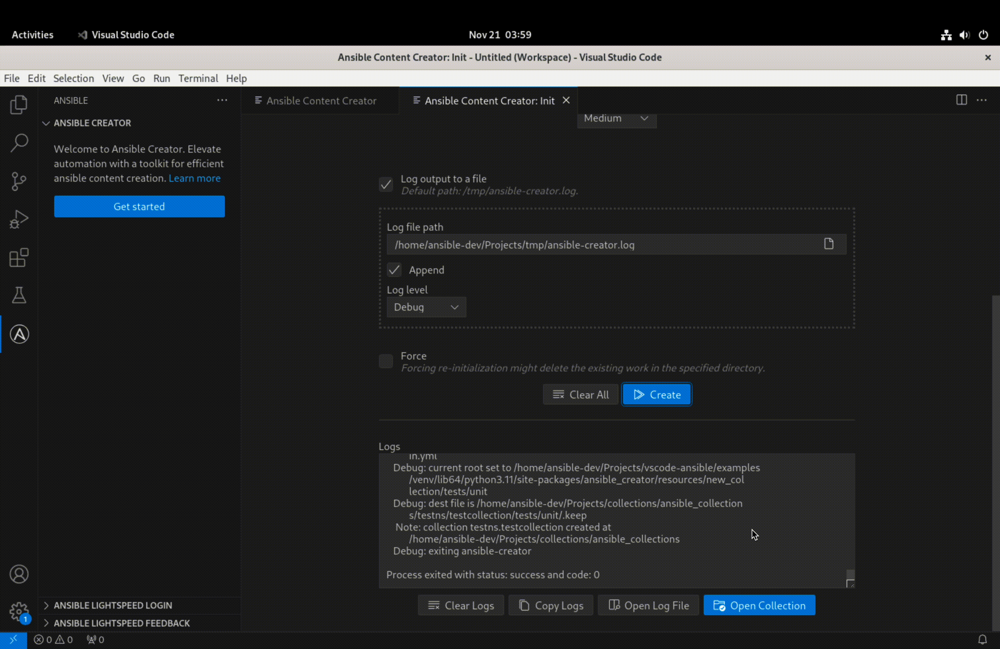

# Creating ansible collection Using ansible-creator and VS Code Ansible extension

For users who prefer a graphical interface, ansible-creator seamlessly integrates with the [Visual Studio Code (VS Code)](https://code.visualstudio.com/docs) and the [Ansible extension](https://marketplace.visualstudio.com/items?itemName=redhat.ansible) for it, offering an intuitive GUI experience. If the command line is not your preferred method, the extension provides a user-friendly alternative. By navigating to the Ansible section in the VS Code activity bar and selecting "Ansible Creator," users can access a menu-driven interface. This GUI simplifies complex tasks such as initializing Ansible Collections by providing interactive forms for straightforward input. The extension enhances the development experience, offering visual cues and options for users who may find a graphical approach more comfortable and accessible. With ansible-creator in VS Code, you can effortlessly manage your Ansible content without delving into the intricacies of command-line operations.

Here is a detailed guide on creating an ansible collection using the ansible-creator and VS Code Ansible extension:

## Step 1: Installing ansible-creator in the Environment

1. Open VS Code and click on the Ansible icon in the activity bar. This action expands and opens the `Ansible Creator` section. Click on _"Get Started"_ to access the Menu page of ansible-creator in the editor.

2. On the Menu page the `System Requirements` box will view details about the current environment, including ansible, Python, and ansible-creator. If ansible-creator is not installed, proceed to the next step.

3. Install ansible-creator or switch to an environment where ansible-creator is already installed. Ensure that all requirements in the `system requirements` box display green ticks to signify a ready environment.

{width=900px align=center}

## Step 2: Initializing Collection by Filling an Interactive Form

1. From the menu page, click on `Initialize a collection` to access the _"Init"_ interface in the editor, providing an interactive form.

2. Enter the namespace and the collection name. You can review the format of your collection name as you type.

3. Specify the initialization path. You can utilize the folder icon to open the folder-browser dialog and select the desired location for the collection.

```{Note}
Use the expanded path; shorthand notations are not supported.
```

{width=900px align=center}

4. Set the verbosity of the output using the options in the dropdown.

5. Optionally, you can log the output to a file by checking the `Log output to a file` option. This reveals additional options related to logging, including selecting the log file, choosing to append to the file, and setting the file logging level.

{width=900px align=center}

6. To re-scaffold an existing collection, check the `Force` box. This removes the existing content in the collection and freshly scaffolds it with the same name.

7. Finally, after reviewing the details, click the `Create` button, and within milliseconds, the collection will be scaffolded in the specified location.

8. You can review the logs or open the log file (if created) in the VS Code Editor for further scrutiny.

{width=900px align=center}

## Step 3: Leveraging the Extension's ability to Interact with the New Collection

1. Once the scaffolding is complete, you can directly add the collection to your current workspace by clicking the provided `Open Collection` button. This will additionally open the `galaxy.yml` file in a new tab in the editor.

{width=900px align=center}

2. Start developing the content within the newly scaffolded collection.

3. A playbook adjacent to the collection will automatically enable language service features such as syntax-highlighting, auto-completion, linting, and go-to definitions. You can leverage these features to enhance the development process seamlessly.
